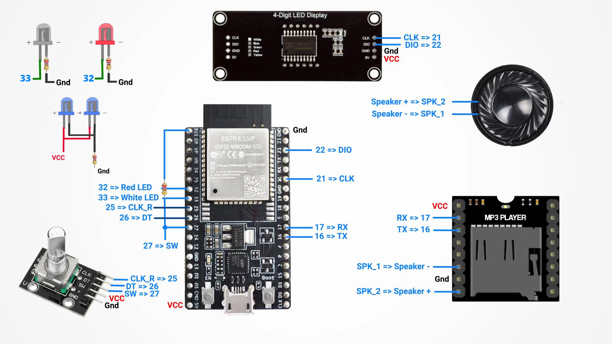
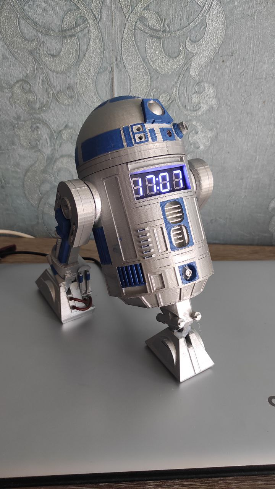

# R2D2

## Printer Settings

| Description       | Value       |
| ----------------- | ----------- |
| Rafts             | No          |
| Supports          | Yes         |
| Resolution        | 0.2         |
| Infill            | 20          |
| Filament brand    | Yes         |
| Filament color    | Yes         |
| Filament material | PLA         |

## Scheme

## How to prepare a Micro SD Card?
- Format a card to Fat32 format
- Copy the mp3 folder to the root, so the path must be /mp3/0001.mp3...

## Result

# Thanks
The initial code and 3D model was done by [jeje95](https://www.thingiverse.com/jeje95) 
[Thingiverse](https://www.thingiverse.com/thing:4870453) 
[GitHub](https://github.com/jejelinge/R2D2_CLOCK_AND_TIMER)